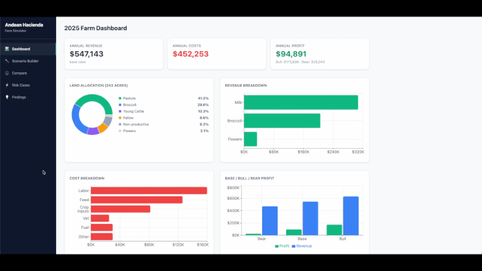

# Andean Farm Simulator

A profit simulator for my family farm in Ecuador. Compare land allocation options for dairy and broccoli, see base/bull/bear outcomes, and pick the setup that makes the remaining acres work hardest.

## What It Does

Andean Farm Simulator models Hacienda Yerovi, a mixed dairy and broccoli farm in Cotopaxi, Ecuador. After a family land sale left the farm with fewer acres, the question became how to allocate what remains between pasture and broccoli under real weather risk.

The web app lets you view the current farm baseline, adjust land, herd, prices, and weather assumptions, and see profit recalculate live across base, bull, and bear cases. You can save scenarios, compare them side by side, and read the final recommendation. A companion spreadsheet goes deeper with Expected Value and an Adjusted Score that also accounts for herd size and how big a land shift each option requires.

## Tech Stack

| Layer | Tools |
|-------|-------|
| Backend | Python, Flask, SQLAlchemy, Flask-Migrate |
| Frontend | React, TypeScript, Vite, Tailwind CSS, Recharts |
| Database | PostgreSQL |
| Analysis | Google Sheets |

## Features

- **Dashboard:** Current land allocation, revenue, costs, and key farm metrics
- **Scenario Builder:** Change land, herd, prices, or weather and see profit update live
- **Compare:** Put saved scenarios side by side with charts and insights
- **Risk Cases:** Edit bull and bear weather and price assumptions
- **Findings:** Scenario comparison, key takeaways, and the recommended allocation

## Project Write-up

- [Summary (2–3 min read)](https://docs.google.com/document/d/1yGW4azk0sb6uLwir5yvu0JsYctBFCGi41uoaaLFxz_M/edit?tab=t.0)
- [Interactive Spreadsheet Model](https://docs.google.com/spreadsheets/d/1piFMMD0oddgiiagxbS0Q9GxREtWFVSpc_Iu81TtX4X8/edit?gid=0#gid=0)
